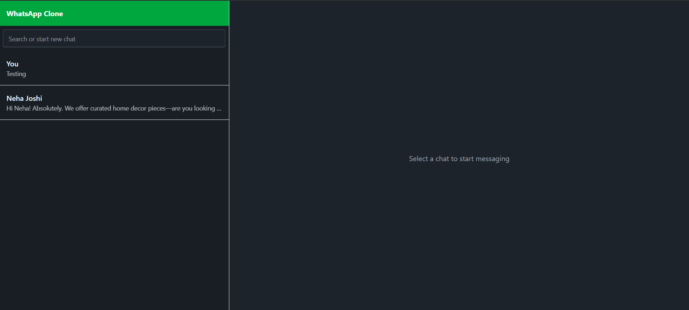
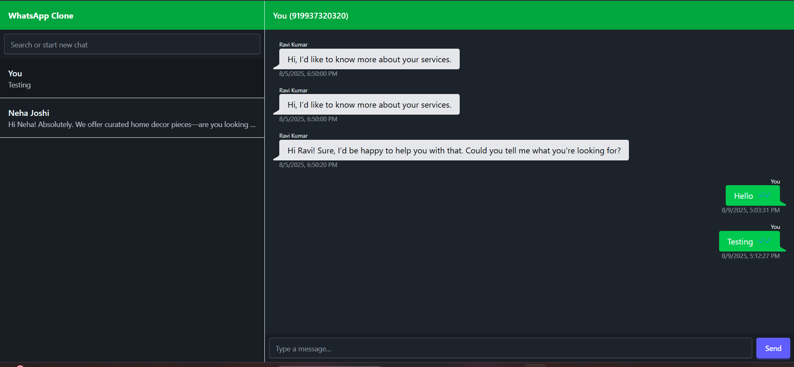
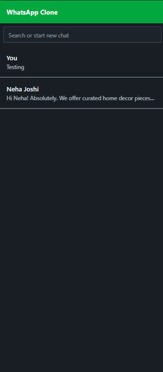

# 💬 WhatsApp Clone – MERN + Socket.IO

A **real-time messaging platform** built with the **MERN Stack** and **Socket.IO**, designed to replicate the core chat experience of WhatsApp Web.  
Includes **Webhook Payload Processing**, **Real-Time Updates**, and a **responsive UI** with **Tailwind CSS + DaisyUI**.

---

## 🔗 Live Links

- **Frontend**: [https://wahts-app-clone-mern.vercel.app/](https://wahts-app-clone-mern.vercel.app/)
- **Backend API**: [https://wahtsapp-clone-mern.onrender.com](https://wahtsapp-clone-mern.onrender.com)
- **GitHub Repo**: [https://github.com/Priyanshu-010/WahtsApp-clone-Mern](https://github.com/Priyanshu-010/WahtsApp-clone-Mern)

---

## 🚀 Features

- ⚡ **Real-time chat** with Socket.IO
- 🔄 **Webhook payload processing** to import messages from `.json` files
- 📩 Send, receive, and update message status (sent, delivered, read)
- 📱 Fully **responsive** layout for mobile and desktop
- 🎨 Styled with **Tailwind CSS** + **DaisyUI** components
- 🔍 Search chat list by name, number, or message
- 🖼️ WhatsApp Web–like UI & layout

---

## 🖼️ Screenshots

### 🗂 Chat List (Desktop)



### 💬 Chat Window


### 📱 Mobile View


---

## 🧰 Tech Stack

### Frontend
- React (Vite)
- Tailwind CSS v4.1
- DaisyUI v5
- Axios
- Socket.IO Client

### Backend
- Node.js
- Express.js
- MongoDB + Mongoose
- Socket.IO
- dotenv
- CORS

---

## 📂 Project Structure

WhatsApp-clone-Mern/
├── backend/
│ ├── controllers/
│ ├── models/
│ ├── payloads/
│ ├── routes/
│ ├── processPayloads.js
│ ├── index.js
│ ├── socket.js
│ └── .env
│
├── frontend/
│ ├── src/
│ │ ├── pages/
│ │ ├── utils/
│ │ ├── App.jsx
│ │ └── Main.jsx
│ └── .env
│
└── README.md

---

## 🧪 Run Locally

### 1️⃣ Clone the Repository
```bash
git clone https://github.com/Priyanshu-010/WahtsApp-clone-Mern.git
cd WahtsApp-clone-Mern

2️⃣ Setup Backend

cd backend
npm install

Create a .env file:
PORT=3000
MONGO_URI=your_mongodb_connection_string

npm run dev

3️⃣ Setup Frontend

cd ../frontend
npm install

Create a .env file:
VITE_API_URL=http://localhost:3000

npm run dev

4️⃣ Processing Payloads (Optional)
If you have .json files for initial messages:

Place them in /backend/payloads/

Run:
node processPayloads.js

---

✍️ Author
Priyanshu Rai
📧 Email: priyanshurai2772@gmail.com
🔗 LinkedIn: linkedin.com/in/priyanshuraidev
💻 GitHub: github.com/Priyanshu-010